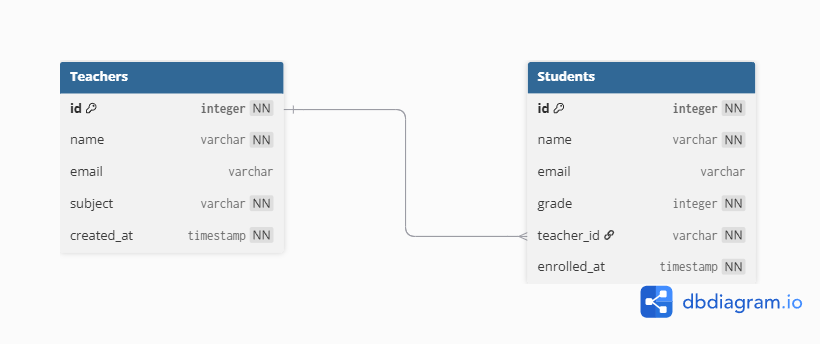

# Django API Practice - 師生管理系統

使用 Django REST Framework 構建的基礎 API 練習題。

## 題目概述

1. 資料表設計(老師&學生) --使用dbdiagram.io進行設計
2. API 接口設計
3. 實作 Django REST Framework 的練習專案，功能包括：

- 老師資料管理（CRUD）
- 學生資料管理（CRUD）

## 技術棧

- **後端框架**: Django 5.2.4
- **API框架**: Django REST Framework 3.16.0
- **資料庫**: SQLite (開發環境)
- **Python版本**: >= 3.13

## 專案結構

```
Django_API_Practice/
├── tutorial/                # Django 主專案
│   ├── settings.py          # Django 設定文件
│   ├── urls.py              # 主路由配置
│   ├── wsgi.py              # WSGI 配置
│   └── todos/               # 主要應用
│       ├── models.py        # 資料模型 (Teachers, Students)
│       ├── serializers.py   # DRF 序列化器
│       ├── views.py         # API 視圖
│       └── migrations/      # 資料庫遷移文件
├── manage.py                # Django 執行檔
├── pyproject.toml           # 專案依賴配置
├── uv.lock                  # 依賴鎖定文件
├── db.sqlite3               # SQLite 資料庫
└── README.md                # 專案說明文件
```

## 資料表設計



## 資料模型

### Teachers (老師)
- `name`: 姓名 (CharField, max_length=50)
- `email`: 電子郵件 (EmailField, unique=True)
- `subject`: 任教科目 (CharField, max_length=32)
- `created_at`: 創建時間 (DateTimeField, auto_now_add=True)

### Students (學生)
- `name`: 姓名 (CharField, max_length=50)
- `email`: 電子郵件 (EmailField, unique=True)
- `grade`: 年級 (IntegerField)
- `enrolled_at`: 入學時間 (DateTimeField, auto_now_add=True)
- `teacher_name`: 關聯老師姓名 (ForeignKey to Teachers)

## 安裝與運行

### 前置需求
- Python >= 3.13
- uv 專案管理工具
 
> **安裝 uv**: 
> ```bash
> # Windows
> pip install uv 
> # macOS/Linux
> brew install uv
> ```

### 安裝步驟

1. **複製專案**
   ```bash
   git clone https://github.com/alexlin1127/Django_API_Practice.git
   cd Django_API_Practice
   ```

2. **安裝專案依賴**
   ```bash
   uv sync  # 會自動創建虛擬環境並安裝所有依賴

   ```

3. **資料庫遷移**
   ```bash
   uv run python manage.py makemigrations
   uv run python manage.py migrate
   ```

4. **創建超級用戶（可選）**
   ```bash
   uv run python manage.py createsuperuser
   ```

5. **啟動開發伺服器**
   ```bash
   uv run python manage.py runserver
   ```

伺服器於 `http://127.0.0.1:8000` 運行。

## API 接口

### 基礎 URL
```
http://127.0.0.1:8000/api
```

### 老師管理 API
- `GET /api/teachers`         - 獲取所有老師列表
- `POST /api/teachers`        - 創建新老師
- `GET /api/teachers/{id}`    - 獲取特定老師詳情
- `PUT /api/teachers/{id}`    - 更新老師信息
- `PATCH /api/teachers/{id}`  - 部分更新老師信息
- `DELETE /api/teachers/{id}` - 刪除老師
- `GET /api/teachers/{id}/showStudent` - 獲取特定老師對應的學生資訊


### 學生管理 API
- `GET /api/students`         - 獲取所有學生列表
- `POST /api/students`        - 創建新學生
- `GET /api/students/{id}`    - 獲取特定學生詳情
- `PUT /api/students/{id}`    - 更新學生信息
- `PATCH /api/students/{id}`  - 部分更新學生信息
- `DELETE /api/students/{id}` - 刪除學生
- `GET /api/students/{id}/image` - 獲取特定學生的圖片

### API 測試工具
- Django REST Framework API URL: `http://127.0.0.1:8000/api`
- Django Admin Dashboard: `http://127.0.0.1:8000/admin`

## 學習要點

- Model 資料表的設計與關聯
- Serializer 資料序列化及二次驗證
- ViewSet 視圖集
- Router 路由配置
- API 權限與認證基礎

## 作者
Alex LIN

## 版本
- 初版 --2025.07.15
- 修訂版v1.2 -- 2025.07.17 (新增教師API路由，可顯示特定老師對應的所有學生)
- 修訂版v1.3 -- 2025.07.18 (新增學生API路由，可顯示特定學生的image / 新增上傳欄位-student_image)